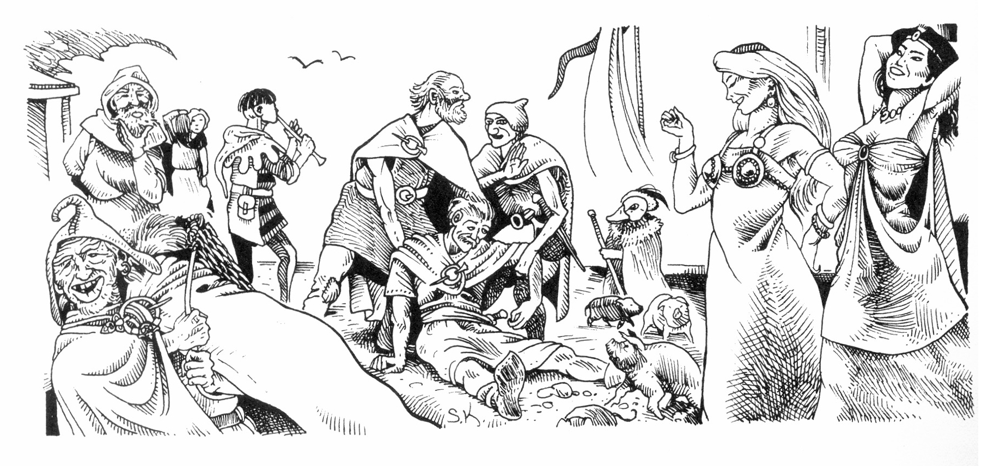
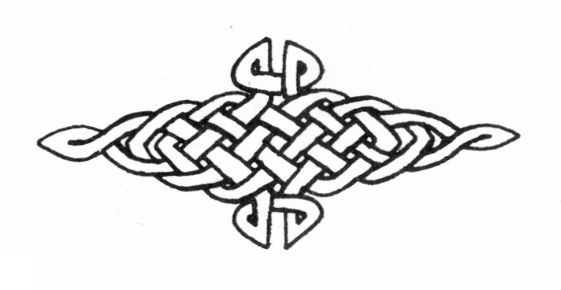

<title>Äventyret börjar - Svavelvinter</title>

# 01. Äventyret börjar

Efter en månads tröttsam seglats över kalla vatten, stiger Marjuras taggiga kust mot er ur dimman som ett hotfullt, levande väsen. Den trakoriska handelskonvoj ni valt att följa närmar sig äntligen resans mål, kolonin Arhem vid rikets yttersta utpost mot norr, bortom vilken oändliga polarvidder tar sin början. De fem rundbottnade farkosterna seglar hela förmiddagen norrut längs ogästvänliga klippor innan en fjord öppnar sig som ett djupt sår i kustlinjen.

Redan vid mynningen är vattnet gulgrumlat och illaluktande, men när hamnen i Arhem sluter sig om skeppen är svavelstanken outhärdlig för era ovana näsor.

Invid fiskebodarna på norra stranden står rader av tysta, ljushyade människor. Ni ser inte ett enda leende, inte ens bland barnen.

Då är dagen gladare bland folket på kajen. Köpmannen stryker förnöjt sina skägg i väntan på varor, en gycklare spelar pipa, horor kråmar sig i eftermiddagssolen, pälsjägare flinar med sina tandlösa munnar och hemförlovade veteraner jublar.

Förtöjningar säkras, men innan någon får tillåtelse att gå iland, lastas straffångarna ut. Bleka och magra dras de fram ur lastrummen, kedjas samman och leds bort utan att deras drogade hjärnor frågar vart eller varför. Blicken vandrar gärna från den obehagliga scenen och följer landets stigning mot de hisnande glaciärer som gnistrar i fjärran. Ni värms vid tanken på att skönhet finns också i detta ödsliga land. Plötsligt bryts lugnet når en härold annonseras med skärande trumpetstötar och högröstat börjar läsa från ett pergament.

"Storhirdman Gottard av Melse, primus prokuratus och kejserlig fogde av västra Marjura, låter hälsa resande folket gott komna till trakoriska nyhamnen Arhem, och ordar sålunda:

I har funnit för väl att Marjura beresa, än fast stormväsen med mycken väderpinad piskar detta helveteshål där intet av mannatrevnad gives.

Låt så vara, då var man bäst smider eget öde och mången söka sig till rikets nyhamnar för att ära och riknad vinna. Föga vill Gottard av Melse eder håg pröva, eller sinnens avsikter utforska med småsinta käringalater. Låt blott följande i minnet få fästnad:

Trakoriske lagar gälla i Arhem, människor och djuriske halvfolk lika, samt därtill vad regelbruk fogdens ämbete för gott finner Således skall den, som rikets svaveltrad på enahanda sätt nännes störa, för detta straffdom undfå i silver, svärd och hårdspö.

Törhända är ni komna av hörnad om dolda gravaguldgömmor i Marjuras vildhedar. Till detta vill sägas att gives dylik skörd att hämta, vore den förvisso bärgad av Gottard sedan långgången tid!

Törhända söken I drakormars boning, men till eder, hjältapiltar, vill sägas att ormen — Blatifagus är dess namn — till fridlevnad sökt sig i gamlingslivet och ej störas må! Till synad av ormens rohet är satt magister Trodax Draconicus av Tricilve å kejserligt ämbete.

Vidare tör sägas att utan tillkänning — härför är straffet väl utmätt — må marker runt träskmarkens slavaboning åt öst ej beträdas.

Det skall vidare vara känt att av var utkomst skördad å Marjuri land eller omvatten, äger fogden rätt att tionde taga å trakoriska rikets vägnar. Sammalunda skall riket åfalla trennedel av fynd i malm, källa eller annan markfrukt.

Så hälsar eder storhirdman Gottard av Melse, och bjuder frid bland gode männer och djuriske halvfolk tillika!"

## Om rollpersonernas bakgrund

Besökare på Marjura är vanligen människor, vita ankor eller vargmän. Dvärgar är sällsynta eftersom de ogillar att åka båt och älvfolk liksom halvlängdsmän bör ha mycket goda skäl för att besöka en så ogästvänlig plats.

För att klara av de svårigheter rollpersonerna kommer att möta bör de vara fler än tre, representera några vitt skilda yrken och ha passerat nybörjarstadiet. Slås nya rollpersoner fram, kan dessa som en tumregel tilldelas 100 bakgrundspoäng extra.

Naturligtvis kan list och gott spel uppväga brister i gruppens sammansättning. Kom bara ihåg att Svavelvinter är en kampanj där andra färdigheter än vapenskicklighet behövs.

## Om rollpersonernas hemland — Trakoriska riket

De fyra öarna Paratorna, Trinsmyra, Saphyna och Palamux bildar tillsammans Trakorien. Genom historien har öarna ständigt försökt dominera varandra, men ändå lyckats behålla visst självstyre. Det senaste seklet har Paratorna varit starkast, och kejsaren regerar från öns största stad Tricilve.

Trakoriska riket är har en feodal prägel och befolkningen kan indelas i fyra samhällsklasser:

1. Adel
2. Borgare och självägande bönder
3. Egendomslösa och livegna bönder
4. Slavar

Trakorisk lag favoriserar högre klasser som därför kan ta sig friheter på de lägre klassernas bekostnad. Spelarna bör tänka på sin rollpersons härstamning och uppträda därefter. Naturligtvis kan man ogilla klassystemet och strunta i det, men då får man försvara sin uppstudsighet efter förmåga.

Det är möjligt att höja sig över sitt ärvda anseende genom utbildning eller bravader och i undantagsfall till och med bli adlad.

Renommerade trollkarlar står vanligen vid sidan av klassväsendet och respekteras av alla.

## Om ön Marjura

Ingen härskare brydde sig någonsin om den karga isklippan Marjura förrän svavel blev en dyrbar handelsvara när Tasenbar Örtkänne upptäckte nyttan av vinsvavling. Någon vittberest rådgivare vid kejsarhovet drog sig då till minnes de stinkande svavelträsken och trakorierna införlivade snabbt Marjura i sitt rike. Träsken vid floden Loberans mynning blev snart en viktig inkomstkälla, men eftersom ingen ville arbeta frivilligt i sumpmarken, anlades ett läger för straffångar. Man fick på så sätt arbetskraft och blev samtidigt kvitt en mängd besvärliga brottslingar.

Emellertid var Marjura inte helt öde när trakorierna invaderade. Fritänkare från Trinsmyra hade i alla tider tagit sin tillflykt till trakterna runt Arhem där de levde av fiske och fårskötsel.

Dessa fritänkare tyckte sig ha rätten till svavelrikedomarna. Ett häftigt, men ojämnt krig utkämpades. I fredsöverenskommelsen bestämdes att marjurerna, med sina underliga idéer om människors lika värde, visserligen skulle lämnas ifred, men att trakorierna skulle dra vinsten av all havshandel och även uppta skatt bland lokalbefolkningen.

Marjuras dvärgar och isjättar bara skakade på sina huvuden och tänkte att en människa är lika illa som någon annan, men andra makter oroades mer av invasionen.

Nästan ett sekel tillbaka i tiden hade en fruktad nekromantikersekt blivit bortdriven från staden Vumbra på Trinsmyra. De kallades shaguliter efter sin mästare Shagul, som i påtvingad exil tagit säte bland Marjuras ödsliga berg. Sekten fruktade trakoriernas ankomst men det visade sig att erövrarna bara intresserade sig för svavelmonopolet. I Dymratraktaten garanterades shaguliterna rätten att fortsätta sina vivisektioner och likstudier så länge experimenten bara utfördes på inköpta slavar eller på öns urinnevånare, de primitiva kvurerna.

Ett bräckligt lugn lägrade sig nu över svaveldalen. Visserligen reste trakoriska äventyrare till Marjura på jakt efter malmfynd eller bortglömda gravfält, men utbytet var inte märkvärdigt, och många försvann i ödemarken.

Det är nu rollpersonerna anländer till ön.

## Om rollpersonernas motiv

Man frågar sig varför någon frivilligt beger sig till Marjura över huvud taget.

Svaret är att minst en av rollpersonerna bör ha kommit till ön för att i hemlighet söka rätt på shagulitersektens högkvarter, det beryktade Järntornet. Anledningen till sökandet kan vara en eller flera av följande:

### Ett heligt uppdrag

Rollpersonen är utsänd av en munk— eller riddarorden, av en animistakademi eller av alviska budbärare för att utplåna shaguliteras vidriga verksamhet en gång för alla. Tidigare har flera utsända försvunnit, och rollpersonen bör försiktigt undersöka vad som har hänt dem. Det ryktas att en hemlighetsfull mördare kallad Tobik finns i Arhem, men att ingen vet vem han är.

### Hämnd

Shaguliterna har rövat bort eller dödat en nära släkting till rollpersonen. Det ryktas allmänt, även om bevis saknas, att sekten för bort personer med avvikande anatomi eller ovanliga egenskaper för att lära sig mera om livets hemligheter.

### Ett politiskt uppdrag

Shaguliternas ambassadör vid trakoriska kejsarhovet har vunnit kejsarinnan Henegyas gunst och därmed fått politiskt inflytande. Sekten måste komprometteras eller ännu hellre utplånas för att inte de onda lärorna ska få fäste på Paratorna. Uppdraget är politiskt känsligt och måste hållas hemligt. Ledaren för aktionen (rollpersonen med högst INT) disponerar 2T6x100 sm extra.

### Sabotage

Bara handelshus från Paratorna får bedriva handel på Marjura enligt kejsarens dekret. Adelsmän på de andra trakoriska öarna oroas av att rikedomarna gör huvudön allt starkare. Rollpersonerna kan vara utsända för att sabotera svavelhandeln för några år framåt genom att ställa till kaos i Arhem.

### Ett legouppdrag

Fingolf Silverhamre, son till den trinsmyriske länsherren Gustald Silverhamre, har i ungdomligt oförstånd rymt till Marjura för att ansluta sig till shagulitersekten. Länsherren vill ha sonen tillbaka, med eller mot dennes vilja. Länsherren ser gärna att Shaguliterna skadas eller komprometteras och betalar ett antal guldmynt om affären sköts diskret. Ledaren för aktionen [rollpersonen med högst INT] disponerar 1T8x100 sm extra.

### Gravplundring

Några äventyrare hemförde för några år sedan urgamla guldföremål från glömda gravfält på Marjura. Lärda män har diskuterat om fynden är äkta eller inte, men om gravfälten finns gäller det att hitta dem först.

### Prospektering

Stora delar av Marjura är ännu inte utforskade. Malmfynd ligger antagligen och väntar på den som hittar dem.

Vinna ära

Det ryktas om att en drake finns på ön. Det kan vara något att bita i för hjältar (eller vice versa).

## Om rollpersonernas utrustning

Rollpersonerna är på väg till en arktisk miljö och bör utrusta sig väl. På Marjura kan man bara handla vardagsförnödenheter och sådant som landet ger. All mer speciell utrustning bör köpas på Paratorna, det vill säga innan spelet börjar. Nyslagna rollpersoner bör börja med dubbelt så mycket pengar som normalt för att kunna köpa en ordentlig utrustning.

## Om transporter till och från Marjura

Konvojer seglar mellan Paratorna och Marjura två gånger om året, vår och höst. Åker ni inte tillbaka när fartygen avseglar inom en vecka, måste ni alltså stanna minst ett halvår. Ni får själva välja om ni anländer på våren eller hösten.

## Rollpersonernas första intryck av Arhem

Hamnstaden Arhem stinker av svavel. Floden Loberans nedersta lopp, som avvattnar träsken, delar Arhem i nya respektive gamla kvarteren, vilka förenas med en stenbro nere vid hamnen. De gamla kvarteren på nordsidan är trångt och planlöst byggda. Här bor bara marjurer. Alla främlingar som vandrar in bland husen möts med hat eller förakt. Närmast floden ligger de öppnare hantverkarkvarteren där olika tjänster kan köpas. Sydsidans nyare kvarter är glest tillbyggda av ditflyttade trakorier. På södra stadsbergets sluttningar, där svavelstanken lättar med höjden, finns handelsmännens och officerarnas hus. De bevakas av garnisonen som tronar på klippans krön. Runt hamnen ligger några större lagerbaracker, men vandrar men motströms längs Loberans södra bank träffar man på marknadsplatsen. Här kan man köpa hudar, karsonolja eller bensniderier av kvurerna, Marjuras ursprungliga nomadbefolkning, eller mat från inresta bönder och fiskare. Torget kantas av tullhuset, köpmännens kontor, ankorna Moggers handelshus och andra respektabla inrättningar. På en sidogata finner man "Junker Hildurs Värdshus", det enda värdshuset i Arhem som tar emot trakorier.

Spelet kan börja! Spelare bör inte läsa längre.
Må Kmorda vara er nådig!

