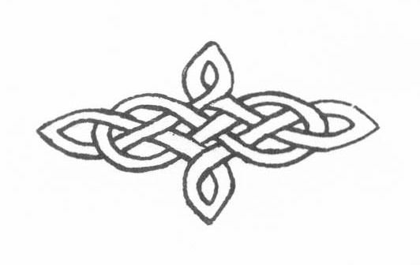

<title>Konstruktörens kommentarer - Svavelvinter</title>

# 14. Konstruktörens kommentarer

Redan i planeringen av Svavelvinter gjorde riddare Arn Dunkelbrink av Lasemos klart för mig att han inte tänkte medverka i något spektakel och stövlade ut ur rummet så att klackjärnen smällde. Ungefär samtidigt upptäckte jag att alkemisten Tasenbar Örtkänne, en av berättelsens pelare, hade blivit så gammal och bitter att han också måste lämnas utanför. Varför gjorde de mig detta? För första gången anade jag sanningen. Trakorien är inte min skapelse; det finns verkligen på sina egna villkor. Som en medeltida bard för jag sångerna vidare. Jag ändrar och lägger historien tillrätta, men har inget inflytande över rikets verkliga öde. Sagovärldens spår finns överallt, I dammiga dokument fann jag till exempel vissa likheter mellan huvudstaden Tricilve och renässansens Florens. Knappt var den insikten öppnad förrän vyer av mäktiga handelsklaner, krabbjakt i morgondimman och fanatiska sekters palatsintriger skapades av sig själva.

Shagulitersektens existens anade jag redan i gymnasiet. Varför har inte naturen samlat fotosyntesen och cellandningen i samma varelse när den annars är så listig? Svaret är givet: Shaguliterna måste finnas. Någon kanske kallar dessa fanatiker onödigt grymma, men inte heller grymheten är mitt påhitt. Shaguliternas konster praktiseras redan på levande varelser i laboratorier världen över.

I min beskrivning har jag alltså så långt följt sanningen. Bara prästinnan Perrima har sluppit undan med en skön lögn, sedan hon med mild röst bett mig skona henne. Detta är beklagligt men naturligt. Varför skulle en konstruktör vara immun mot sina figurers häxkonster?

Av utrymmesskäl har ni spelare och spelledare bara genomlevt en del av Trakoriens krönika. Ni vet ännu inget om Tricilves död, om guden Remuntra eller om den sanna innebörden i ordet Svavelvinter. Men kanske får ni tillfälle återvända att någon gång. Hittills har era upplevelser varit olika, men dessa olikheter är bara skenbara variationer. I en punkt löper alla händelser samman och först då avgörs framtiden. Denna punkt är Konfluxen.

*Jönköping, februari 1987*
*Erik Granström*

