<title>Kartor - Svavelvinter</title>

# 15. Kartor

### Trappförklaring

## Marjura

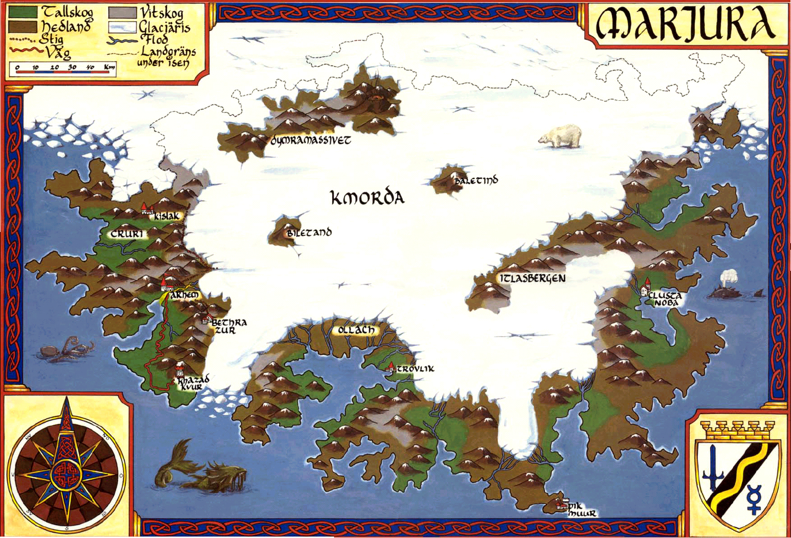

## Trakorien

## Arhem

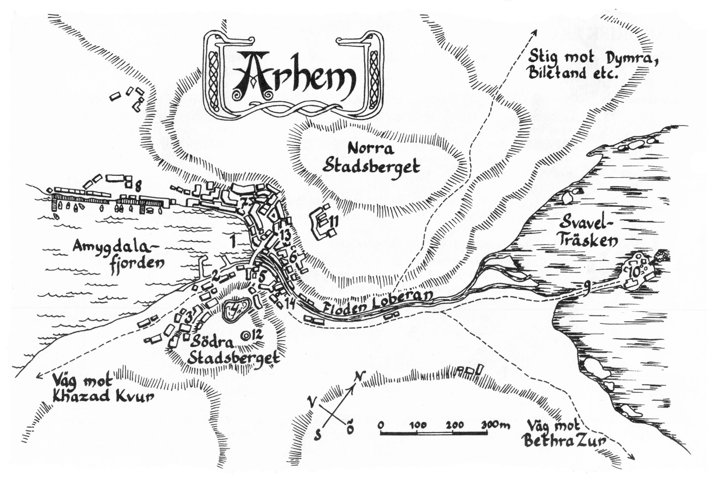

### Junker Hildurs

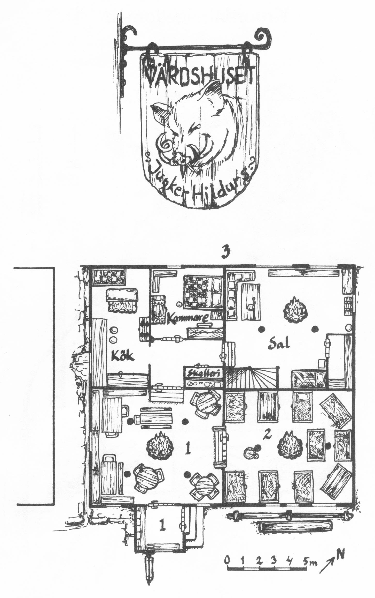

## Kmordahelgedomen

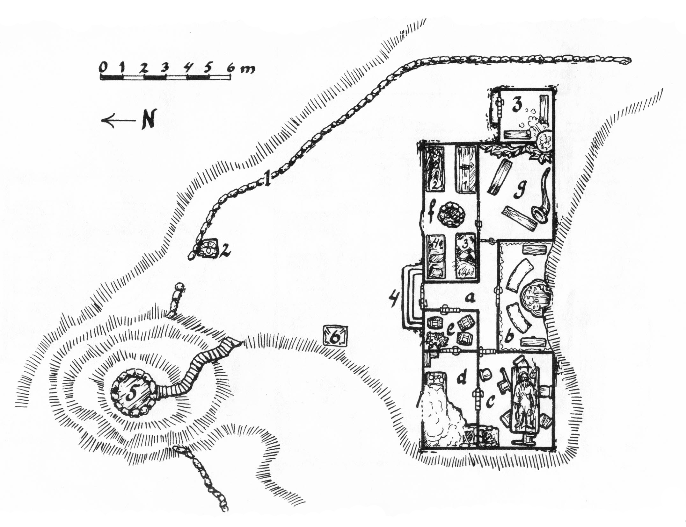

### Kryptan under helgedomen

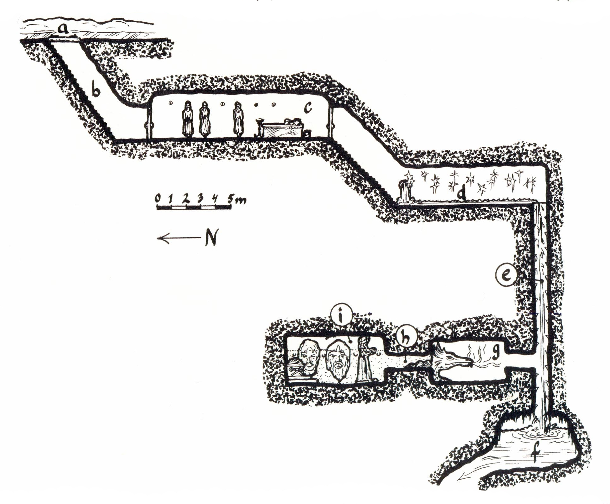

### Drakfällan

*＊ Hinner rollpersonerna ut? Räkna med att det tar 1 SR att ta sig till passagen där köbildning lär uppstå. Den som står närmast kommer först. Det tar sedan 15+(2xSTO) sekunder att ta sig genom drakmunnen. Dessutom måste man ha högst STO 13 och ta av sig ryggsäck, helrustningar och andra hindrande saker (enligt SLs bedömning). Om det står en person på andra sidan drakmunnen och drar ut en med rep går det dubbelt så snabbt.*

*Om en person blir kvar i rummet är bästa sättet att överleva att klättra upp på kvinnostatyernas böcker, dit vattnet inte når. Istället blir personen ångkokt och får en poäng skada var femte minut han befinner sig i ångan. Denna skada dras från Totala KP.*

När spelarna har "kommit in” i diagrammet måste de följa pilarna. Oavsett vad spelarna hittar på kan de inte få fällan att göra något annat än det pilarna visar. T ex går det inte att rubba ett solkors om kistan har öppnats. En ifylld pil innebär att nästa steg sker automatiskt efter en viss, angiven tidsperiod, som mäts i SR om annat inte anges. En ihålig pil innebär att spelarna kan välja om de vill utföra nästa steg. **Vid flera alternativ får endast ett väljas.**

## Kung Ottars grav

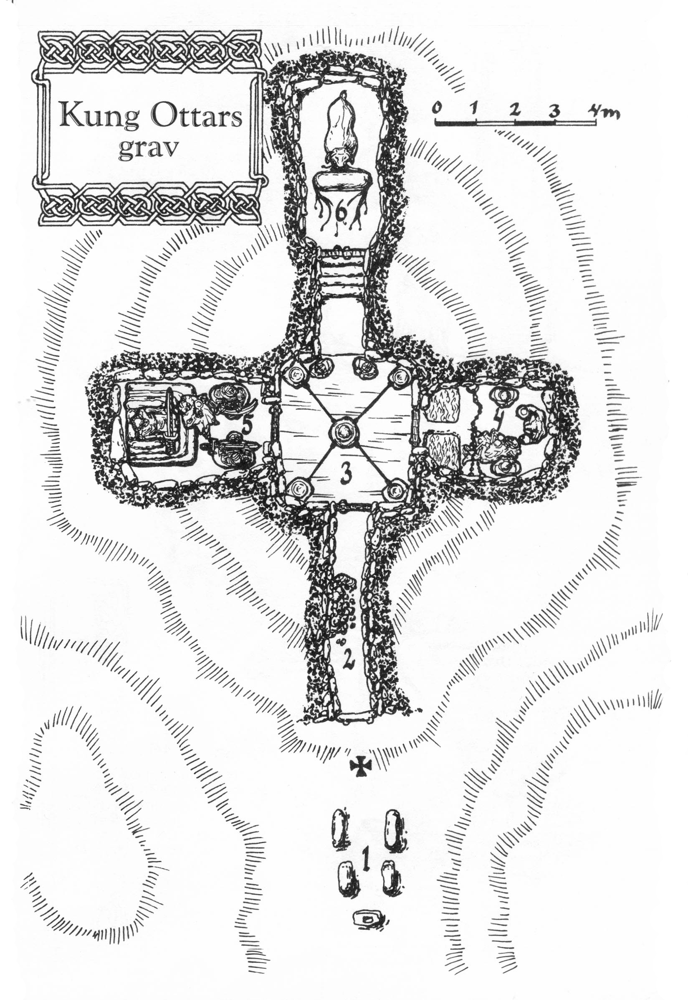

### Minotaurfällan

Om endast ett av de två föremålen (a) lyfts från statyns händer tippas den åt sidan genom det andras tyngd. Då öppnas munstycket (b) och lättantändlig vätska strömmar från behållaren (c) ut på golvet. Detta lutar mot elddiket (d) och när vätskan når dit flammar den häftigt upp.

### Fyrfatsfällan

När man lyfter fyrfatet (a) lossnar hörnstenen (b). Stenen sitter fast i bronsstaget (c) och faller i en pendelrörelse mot pelaren (d) som slås omkull. Detta leder till att taket störtar in.

## Kvicksilvergruvan

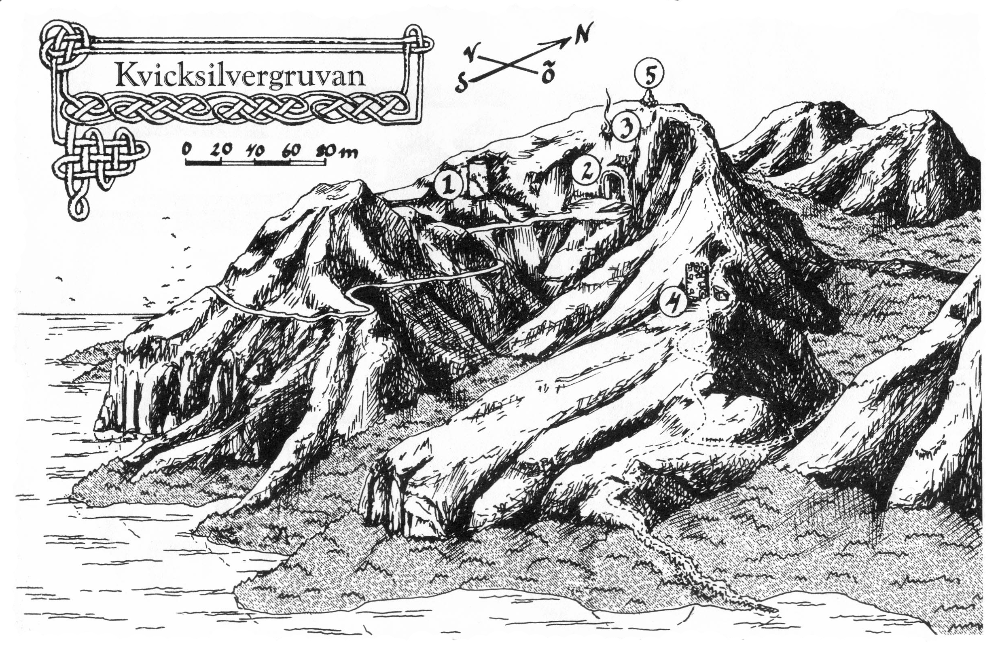

### Kontornet

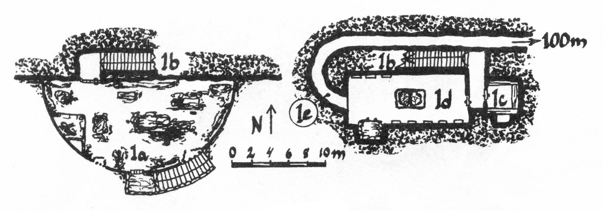

### De två statyerna

När de två statyerna upphettas expanderar den ena medan den andra krymper. Detta till att golvet vrids kring sin axel och öppningen till den hemliga gången uppenbaras.

### Drakens håla

### Gruvans andra plan

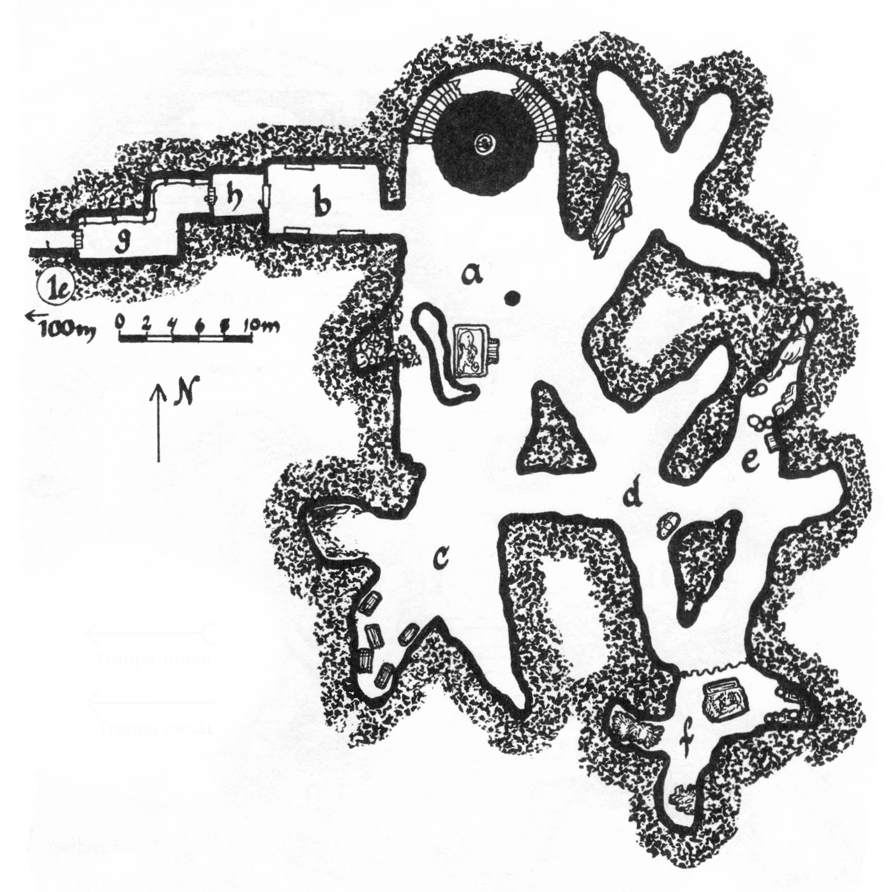

### Gruvans tredje plan

### Vakttornet

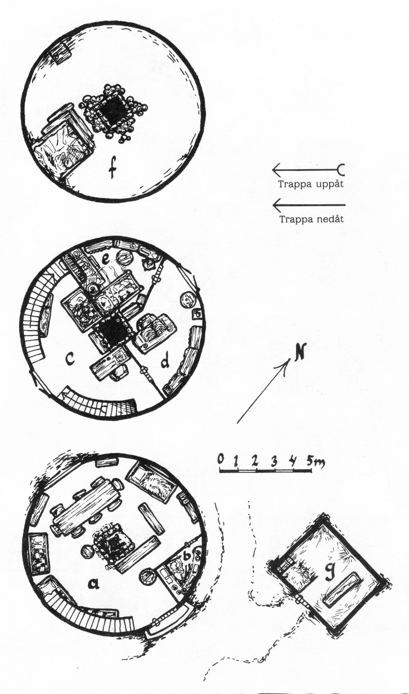

## Svavelträsket

### Sulidon Rumperlaks hus

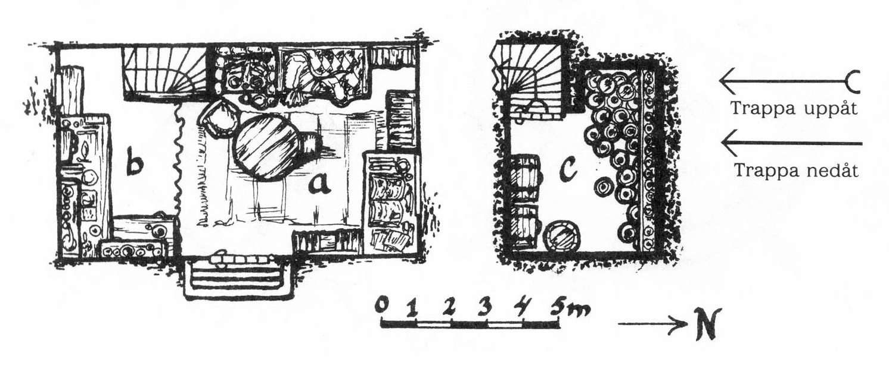

## Järntornet

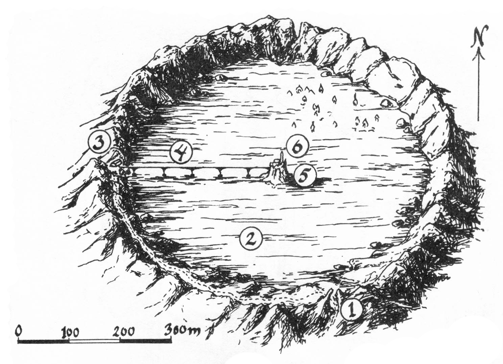

### Ingångsplan

Trappa l leder till a på övre källarplanet.

Trappa d leder till korridor e på övre källarplanet och fortsätter till sal a på nedre källarplanet.

Trapporna från rum c leder upp till gallerierna på övervåningen.

### Övervåning

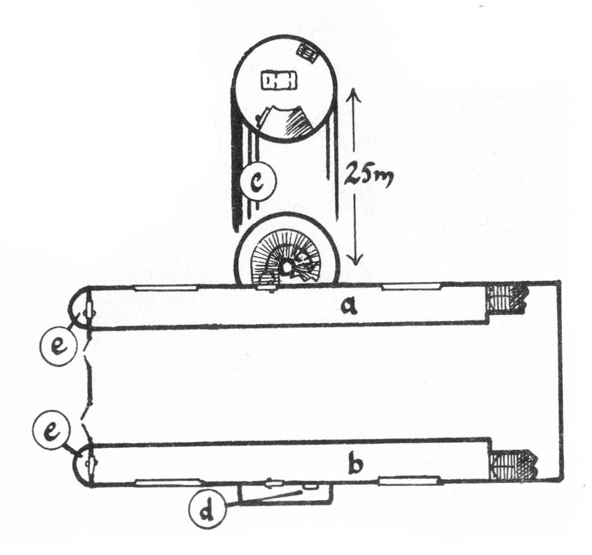

### Tak

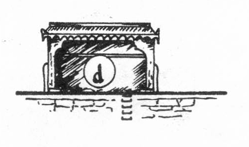

### Övre källarplan

Trappan från rum d leder till sal a på nedre källarplanet, alldeles invid rum f.

### Nedre källarplan

### Shaguls grav

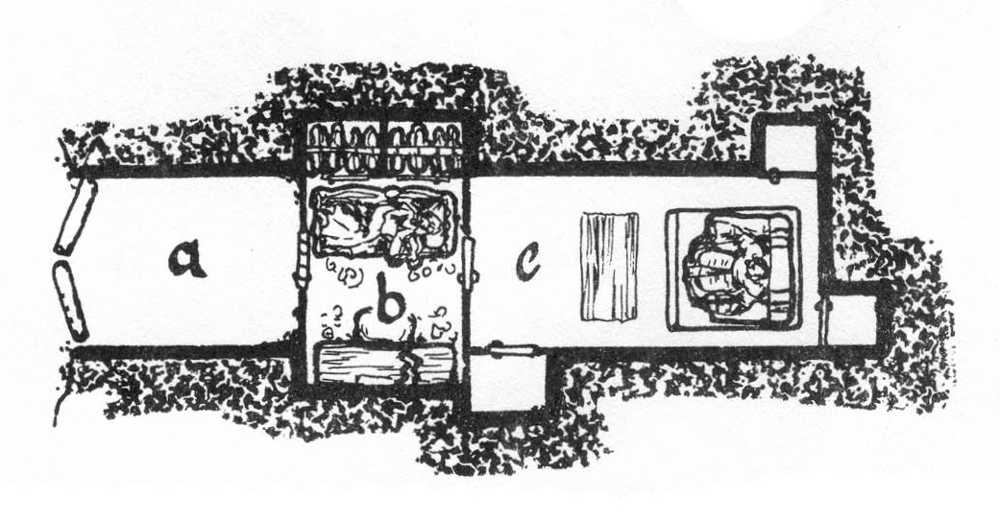

